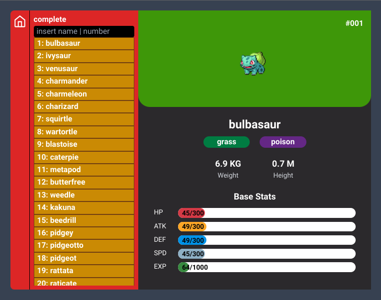

# Pokedex Test Angular

https://pokedex-test-angular.netlify.app/

## Stack

- [TypeScript](https://www.typescriptlang.org/) - JavaScript con sintaxis para tipos
- [Angular](https://angular.io/) - Un framework para crear paginas SPA
- [RxJS](https://rxjs.dev/) - Biblioteca de extensiones reactivas para JavaScript
- [Tailwind CSS](https://tailwindcss.com/) - Un framework de CSS
